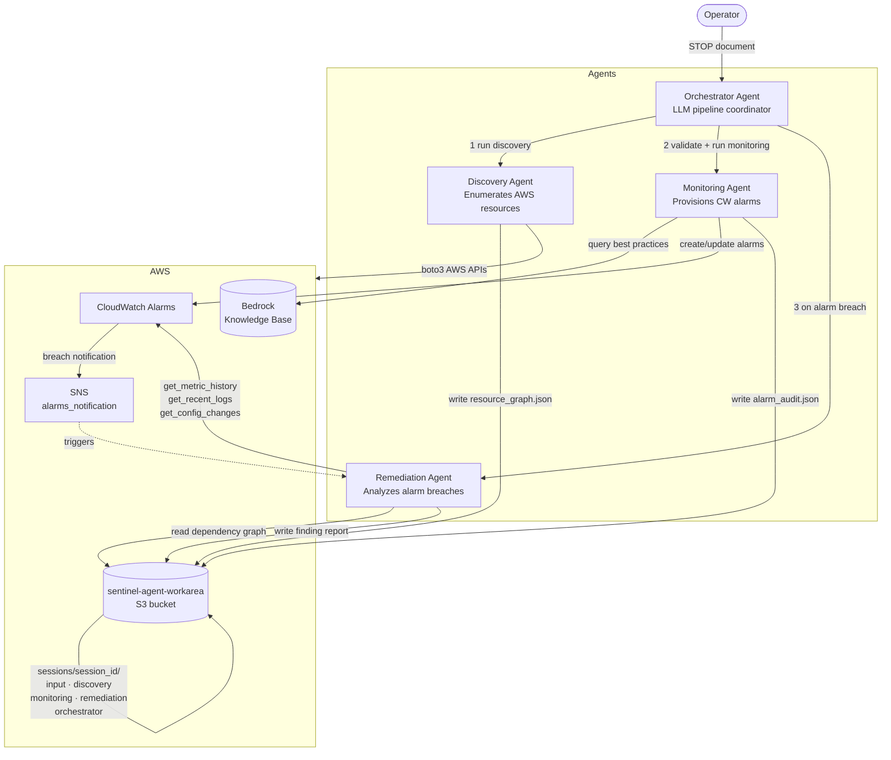

# Sentinel Strands

A multi-agent observability system built on the [Strands](https://strandsagents.com/) framework and deployed on [Amazon Bedrock AgentCore](https://aws.amazon.com/bedrock/agentcore/). It automates the full lifecycle of cloud resource observability: discovery → alarm provisioning → breach remediation.

## Architecture



## Agents

| Agent | File | Role |
|---|---|---|
| Orchestrator | `agents/orchestrator_agent.py` | Coordinates the pipeline, validates outputs, retries on failure |
| Discovery | `agents/discovery_agent.py` | Enumerates AWS resources from a STOP document |
| Monitoring | `agents/monitoring_agent.py` | Provisions recommended CloudWatch alarms using KB best practices |
| Remediation | `agents/remediation_agent.py` | Analyzes alarm breaches and produces structured finding reports |

## Project Structure

```
sentinel-strands/
├── agents/                    # Agent entrypoints (BedrockAgentCoreApp)
│   ├── orchestrator_agent.py
│   ├── discovery_agent.py
│   ├── monitoring_agent.py
│   └── remediation_agent.py
├── tools/                     # @tool-decorated functions used by agents
│   ├── discovery_tools.py     # boto3 resource enumeration + S3 write
│   ├── monitoring_tools.py    # CloudWatch alarm management + KB queries
│   └── remediation_tools.py  # CW metric history, logs, config changes
├── utils/
│   ├── config.py              # Loads config.properties, env vars override
│   ├── models.py              # STOP document dataclasses
│   ├── session.py             # Session ID generation + S3 path helpers
│   └── stop_parser.py         # STOP document parser/validator
├── infra/
│   ├── iam-roles.cfn.yaml     # AgentCore execution role + discovery role
│   └── observability-infra.cfn.yaml  # KB, SNS, workarea bucket
├── invoke_agent.py            # Unified CLI to invoke any agent locally
├── config.properties          # All configuration (env vars override)
└── samples/
    ├── stop.json              # Sample STOP document
    └── alarm_event.json       # Sample alarm event for remediation testing
└── requirements.txt
```

## Prerequisites

```bash
pip install -r requirements.txt
```

AWS credentials configured with access to the target account.

## Configuration

All settings live in `config.properties`. Environment variables of the same name override file values.

```properties
# Run mode
RUN_TYPE=local                    # local | agentcore

# IAM
DISCOVERY_ROLE_ARN=arn:aws:iam::ACCOUNT:role/CloudDiscoveryAgentRole

# Bedrock models
MODEL_ID=us.amazon.nova-pro-v1:0
MONITORING_MODEL_ID=us.anthropic.claude-3-5-sonnet-20241022-v2:0

# AWS
AWS_REGION=us-east-1

# S3 workarea (all agents share this bucket, keyed by session ID)
WORKAREA_BUCKET=sentinel-agent-workarea-ACCOUNT

# Bedrock Knowledge Base
KNOWLEDGE_BASE_ID=<kb-id>
KNOWLEDGE_BASE_DATA_SOURCE_ID=<ds-id>    # used to trigger re-ingestion
KNOWLEDGE_BASE_BUCKET=cloud-discovery-agent-kb-ACCOUNT  # upload new docs here

# SNS
ALARMS_NOTIFICATION_TOPIC_ARN=arn:aws:sns:us-east-1:ACCOUNT:alarms_notification

# AgentCore ARNs (only needed when RUN_TYPE=agentcore)
ORCHESTRATOR_AGENT_ARN=
AGENT_ARN=
MONITORING_AGENT_ARN=
REMEDIATION_AGENT_ARN=
```

## Infrastructure Setup

Deploy both CFN stacks once:

```bash
# IAM roles + results bucket
aws cloudformation deploy \
  --template-file infra/iam-roles.cfn.yaml \
  --stack-name sentinel-iam \
  --capabilities CAPABILITY_NAMED_IAM \
  --parameter-overrides EnvironmentType=dev DiscoveryRegion=us-east-1

# Knowledge Base + SNS + workarea bucket
aws cloudformation deploy \
  --template-file infra/observability-infra.cfn.yaml \
  --stack-name sentinel-observability \
  --capabilities CAPABILITY_NAMED_IAM
```

Seed the Knowledge Base with AWS best practices content:

```bash
# Upload content and trigger ingestion
aws s3 sync ./kb-content/ s3://cloud-discovery-agent-kb-ACCOUNT/
aws bedrock-agent start-ingestion-job \
  --knowledge-base-id <KNOWLEDGE_BASE_ID> \
  --data-source-id <KNOWLEDGE_BASE_DATA_SOURCE_ID> \
  --region us-east-1
```

To re-sync the Knowledge Base after adding new best-practices documents:

```bash
# Upload new or updated documents
aws s3 cp my-new-runbook.md s3://$KNOWLEDGE_BASE_BUCKET/

# Trigger re-ingestion (values from config.properties)
aws bedrock-agent start-ingestion-job \
  --knowledge-base-id $KNOWLEDGE_BASE_ID \
  --data-source-id $KNOWLEDGE_BASE_DATA_SOURCE_ID \
  --region us-east-1

# Check ingestion status
aws bedrock-agent get-ingestion-job \
  --knowledge-base-id $KNOWLEDGE_BASE_ID \
  --data-source-id $KNOWLEDGE_BASE_DATA_SOURCE_ID \
  --ingestion-job-id <job-id-from-above> \
  --region us-east-1 \
  --query "ingestionJob.{status:status,indexed:statistics.numberOfNewDocumentsIndexed,failed:statistics.numberOfDocumentsFailed}"
```

## Running Locally

### Full pipeline (recommended starting point)

```bash
python invoke_agent.py --agent orchestrator --stop samples/stop.json
```

This runs: discovery → validate → monitoring → validate → write summary.
Each run gets a unique session ID. All outputs land in:
```
s3://sentinel-agent-workarea-ACCOUNT/sessions/<session_id>/
```

### Individual agents

```bash
# Discovery only
python invoke_agent.py --agent discovery --stop samples/stop.json

# Monitoring only (point at an existing discovery output)
python invoke_agent.py --agent monitoring --s3-key my-env/20260226T054949Z.json

# Remediation — analyze an alarm breach
python invoke_agent.py --agent remediation --alarm-event samples/alarm_event.json
```

### STOP document format

```json
{
  "stop_version": "1.0",
  "environment": {
    "name": "my-env",
    "provider": "aws",
    "type": "dev",
    "regions": ["us-east-1"]
  },
  "entry_points": [
    { "type": "account", "id": "123456789012", "region": "us-east-1" }
  ],
  "hints": {
    "known_services": ["ec2", "s3"],
    "exclude_namespaces": [],
    "tech_stack": ["postgres", "redis"]
  },
  "agent_config": {
    "discovery_depth": "shallow",
    "autonomy_level": "standard",
    "max_resources_scanned": 50,
    "dry_run": false
  }
}
```

`discovery_depth`: `shallow` (EC2, ECS, RDS, S3, Lambda, ELB) | `standard` (+ SNS, SQS, DynamoDB, ElastiCache) | `deep` (+ MSK, API GW, EKS, OpenSearch)

### Alarm event format (remediation agent)

```json
{
  "alarm_name": "MyAlarm-Errors",
  "state": "ALARM",
  "reason": "Threshold Crossed: 1 datapoint [8.0] was greater than the threshold (1.0).",
  "metric_name": "Errors",
  "namespace": "AWS/Lambda",
  "dimensions": { "FunctionName": "my-function" },
  "session_id": "<YOUR_SESSION_ID>"
}
```

`session_id` is optional — if provided, the agent reads the discovery dependency graph to identify downstream impact.

### Testing a real alarm breach

```bash
# 1. Lower threshold to guarantee a breach
aws cloudwatch put-metric-alarm --alarm-name <name> --threshold 0 \
  --evaluation-periods 1 [... other params unchanged]

# 2. Publish metric datapoints
aws cloudwatch put-metric-data --namespace AWS/Lambda --metric-name Errors \
  --dimensions Name=FunctionName,Value=<function> --value 5 --unit Count

# 3. Force alarm state (if CloudWatch evaluation hasn't fired yet)
aws cloudwatch set-alarm-state --alarm-name <name> \
  --state-value ALARM --state-reason "Test breach"

# 4. Run remediation agent
python invoke_agent.py --agent remediation --alarm-event samples/alarm_event.json

# 5. Restore original threshold
aws cloudwatch put-metric-alarm --alarm-name <name> --threshold <original> \
  --evaluation-periods 3 [... other params]
```

## Deploying to AgentCore

1. Edit `.bedrock_agentcore.yaml` — account ID is already set.
2. Deploy each agent:

```bash
agentcore deploy --agent orchestrator_agent
agentcore deploy --agent discovery_agent
agentcore deploy --agent monitoring_agent
agentcore deploy --agent remediation_agent
```

3. Copy the returned ARNs into `config.properties`:

```properties
RUN_TYPE=agentcore
ORCHESTRATOR_AGENT_ARN=arn:aws:bedrock-agentcore:us-east-1:ACCOUNT:runtime/orchestrator_agent-XXXXX
AGENT_ARN=arn:aws:bedrock-agentcore:...
MONITORING_AGENT_ARN=arn:aws:bedrock-agentcore:...
REMEDIATION_AGENT_ARN=arn:aws:bedrock-agentcore:...
```

4. Invoke exactly the same way — `invoke_agent.py` routes to AgentCore automatically:

```bash
python invoke_agent.py --agent orchestrator --stop samples/stop.json
```

## Session Workarea Layout

Every pipeline run produces a session ID (`YYYYMMDDTHHMMSSZ-<8hex>`) and writes all artifacts under a single S3 prefix:

```
sessions/<session_id>/
  input/stop.json                  ← original STOP document
  discovery/resource_graph.json    ← discovered resources + dependencies
  monitoring/alarm_audit.json      ← alarm recommendations + created alarms
  remediation/<alarm_name>.json    ← finding report per alarm breach
  orchestrator/run_summary.json    ← pipeline trace + step statuses
```

Sessions expire after 90 days (S3 lifecycle rule).

## Environment Variables

All `config.properties` keys can be overridden at runtime:

```bash
DISCOVERY_ROLE_ARN=arn:... LOG_LEVEL=DEBUG python invoke_agent.py --agent discovery --stop samples/stop.json
```
